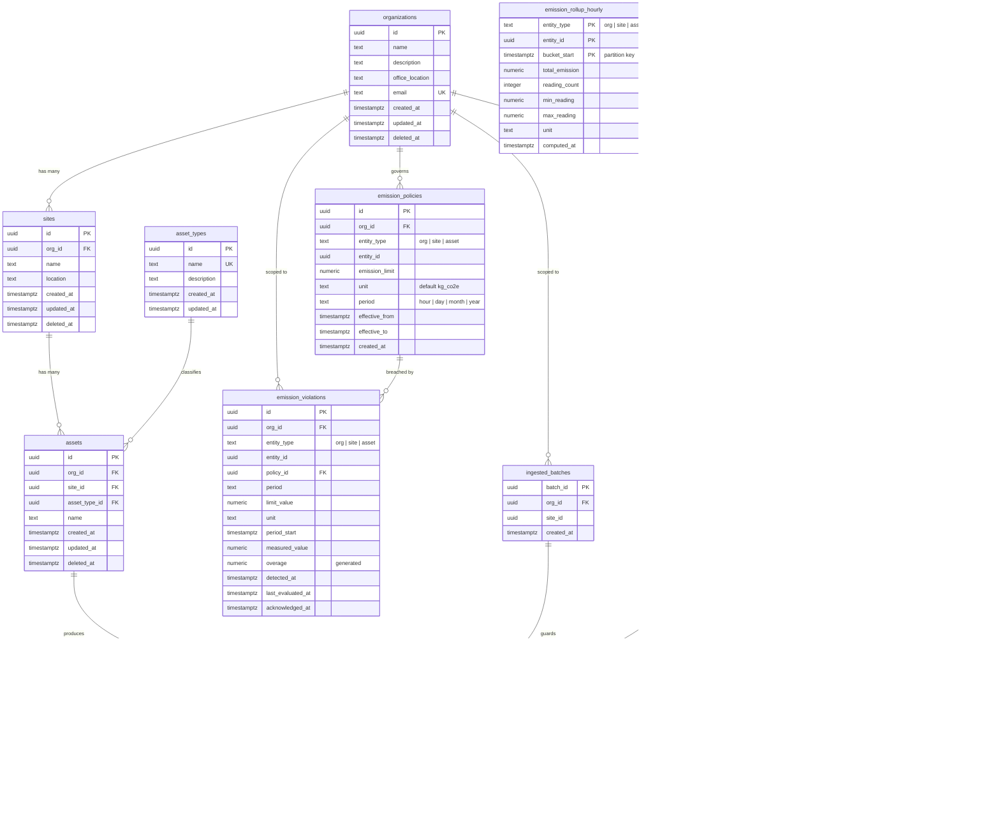
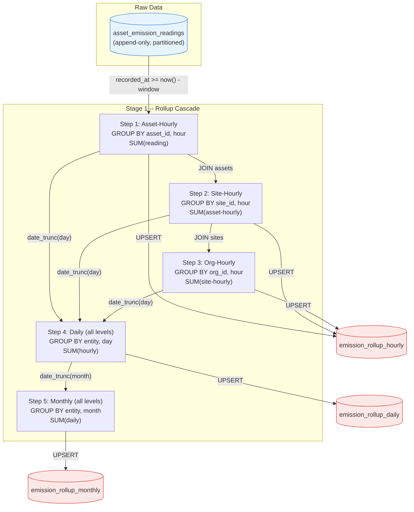
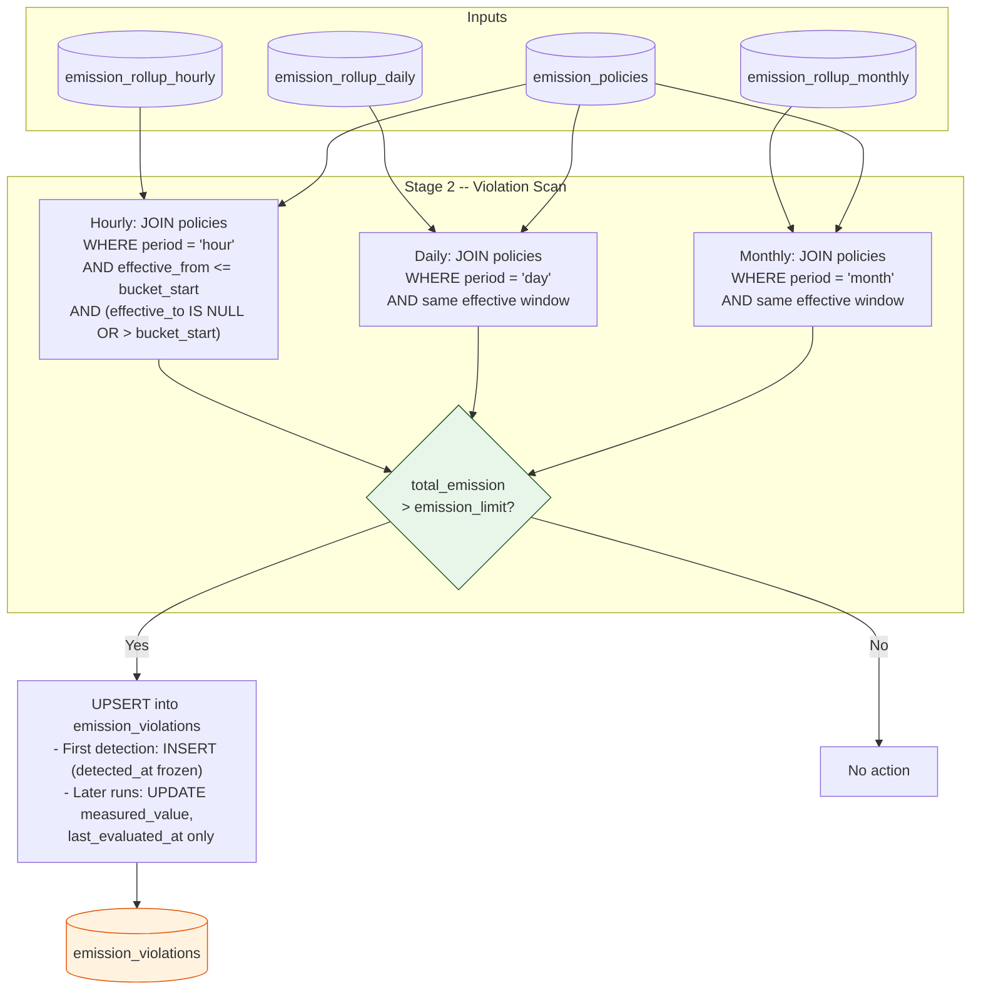

# Database Schema

Full schema is defined in [`migration/sql/002_create_fountation.sql`](migration/sql/002_create_fountation.sql). Migration version 1 is the River job queue schema (Go-based).

## Entity Relationship Diagram

## Key Constraints

| Constraint | Table | Purpose |
| --- | --- | --- |
| Composite FK `(org_id, id)` | `sites` | Assets reference `(org_id, site_id)` as a pair, so a site can never be paired with the wrong org. |
| Composite FK `(org_id, site_id, id)` | `assets` | Readings reference `(org_id, site_id, asset_id)` as a triple, transitively guaranteeing hierarchy integrity. |
| `EXCLUDE USING GIST` | `user_recorder_devices` | No two assignments for the same device may overlap in time. |
| `EXCLUDE USING GIST` | `emission_policies` | No two policies for the same `(entity_type, entity_id, period)` may overlap in time, so the violation scan always finds at most one governing policy. |
| Composite PK `(id, recorded_at)` | `asset_emission_readings` | The partition key (`recorded_at`) must be part of every unique constraint in a partitioned table. |
| PK on `batch_id` | `ingested_batches` | Prevents the TOCTOU race on duplicate-batch detection. Concurrent transactions block on the INSERT rather than both passing a SELECT EXISTS check. |
| Ownership check | `recorder_devices` | `field_device` must have `org_id IS NULL`; `sensor` and `satellite` must have `org_id IS NOT NULL`. |

## Partitioning

| Table | Partition scheme | Reason |
| --- | --- | --- |
| `asset_emission_readings` | Monthly by `recorded_at` | Highest-volume table. Time-windowed queries prune to recent partitions; old data can be dropped instantly. |
| `emission_rollup_hourly` | Monthly by `bucket_start` | ~9.6M rows/year at ~1,100 entities. Partitioning keeps scans fast for recent data. |
| `emission_rollup_daily` | Not partitioned | ~400k rows/year -- small enough to remain a single table. |
| `emission_rollup_monthly` | Not partitioned | ~13k rows/year -- trivially small. |

The foundation migration (002) pre-creates partitions for 2026-05 through 2026-07. The seed data migration (005) dynamically creates additional partitions as needed to cover its 60-day lookback window. In production, use `pg_partman` to create partitions ahead of time automatically.

## Emission Rollup Engine

The `refresh_emissions(window)` stored procedure recomputes rollup aggregates and detects policy violations. It is called by River background jobs on two schedules: every 1 minute with a 3-hour window and every hour with a 48-hour window.

The procedure is **stateless and idempotent**: every write is an upsert, so re-running or overlapping executions are harmless.

### Rollup Cascade (Stage 1)

Readings are scanned exactly once. Every other bucket is derived by summing the level below.

**Why the cascade works:**

- A site total equals the sum of its assets; an org total equals the sum of its sites. A day equals 24 hours; a month equals its days.
- There is one base computation (asset-hourly from raw readings). Everything else sums the level below.
- The `window` parameter (default 48 hours) controls how far back to recompute, accommodating late-arriving data from field engineers who sync with up to a 24-hour delay.

### Policy Violation Scan (Stage 2)

After rollups are current, the procedure checks each rollup bucket against its governing policy.

**Policy matching rules:**

1. **Entity match** -- the policy's `(entity_type, entity_id)` must equal the rollup row's entity.
2. **Grain match** -- the policy's `period` (hour/day/month) must match the rollup table's grain.
3. **Time match** -- the policy must have been in effect at the bucket's start time: `effective_from <= bucket_start` and `effective_to IS NULL OR effective_to > bucket_start`.

The `bucket_start` rule means a mid-period policy change takes effect at the **next** period boundary, not mid-period.

**Violation upsert behavior:**

- The conflict target is `(entity_type, entity_id, policy_id, period_start)` -- one violation per breached bucket.
- On first detection: `detected_at` and the policy snapshot (`limit_value`, `unit`, `period`) are frozen.
- On subsequent runs: only `measured_value` and `last_evaluated_at` are updated. Because readings are append-only, a breach is permanent -- totals only grow.
- `acknowledged_at` is set by a human operator via the dashboard; the scan never touches it.

**Note:** `period = 'year'` policies are not evaluated. There is no yearly rollup table. To support yearly policies, either add `emission_rollup_yearly` with a sixth step or sum the 12 monthly buckets at query time.

## Views

| View | Source | Purpose |
| --- | --- | --- |
| `emission_total_to_date` | `emission_rollup_monthly` | Lifetime total emission per entity. Uses the monthly table because it is the smallest (~13k rows/year) and the current month's bucket already contains everything rolled up so far. |
